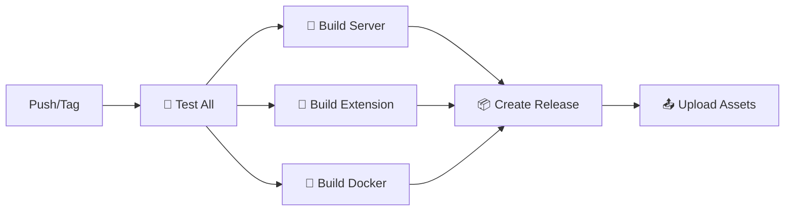

# 🦕 Deno MCP Server Monorepo

A comprehensive monorepo containing a secure Model Context Protocol (MCP) server
built with Deno and a VS Code extension for seamless integration.

[](https://github.com/your-username/deno-mcp-server/actions)
[](https://github.com/your-username/deno-mcp-server/releases)

## 📦 Packages

| Package                                             | Description                           | Version                                               | Tests            |
| --------------------------------------------------- | ------------------------------------- | ----------------------------------------------------- | ---------------- |
| **[Server](packages/server/)**                      | Deno MCP Server with 6 tools          |  | 🧪 Comprehensive |
| **[VS Code Extension](packages/vscode-extension/)** | Private extension with auto-detection |   | 🧪 70+ Tests     |

## 🚀 Quick Start

### For Users

**Download Latest Release:**

```bash
# Get the latest release
curl -s https://api.github.com/repos/your-username/deno-mcp-server/releases/latest \
  | grep browser_download_url \
  | cut -d '"' -f 4 \
  | wget -qi -

# Install VS Code extension
code --install-extension deno-mcp-extension.vsix
```

**Using Docker:**

```bash
docker pull ghcr.io/your-username/deno-mcp-server/server:latest
docker run -it ghcr.io/your-username/deno-mcp-server/server:latest
```

### For Developers

```bash
# Clone and setup
git clone <your-repo-url>
cd deno-mcp-server

# Build everything
.\build.ps1 all

# Run tests
.\build.ps1 test

# Start development
cd packages/server && deno run --allow-all cli.ts
```

## 🏗️ Build System

Unified PowerShell build script with comprehensive commands:

```powershell
.\build.ps1 <command> [options]

Commands:
  fmt          Format code in both packages  
  lint         Run linting on both packages
  check        Type check both packages
  test         Run all tests (70+ tests total)
  build        Build both packages 
  package      Package both for distribution
  all          Run fmt, lint, check, test, build, package
  clean        Clean build artifacts

Options:
  -ServerOnly  Only operate on server package
  -ExtOnly     Only operate on extension package  
  -ShowVerbose Show detailed output
```

## 🤖 Automated Releases

### Release Triggers

**Automatic (Tag-based):**

```bash
git tag v1.2.3
git push origin v1.2.3
# → Triggers full release pipeline
```

**Manual (GitHub Actions):**

- Go to Actions → 🚀 Release → Run workflow
- Configure what to release (server, extension, both)
- Set version and options

### Release Artifacts

Each release automatically creates:

- 🏗️ **Cross-platform Binaries**
  - Windows: `deno-mcp-server-windows-x64.exe`
  - Linux: `deno-mcp-server-linux-x64`
  - macOS: `deno-mcp-server-macos-x64`

- 🎯 **VS Code Extension**
  - `deno-mcp-extension.vsix` - Installable extension package

- 🐳 **Docker Images**
  - `ghcr.io/your-username/deno-mcp-server/server:latest`
  - `ghcr.io/your-username/deno-mcp-server/server:v1.2.3`

- 📝 **Release Notes** - Auto-generated with installation instructions

### CI/CD Pipeline



## 🔒 Security Features

- **Multi-layered Security**: Permission-based access control
- **Input Validation**: Comprehensive sanitization
- **Secure Operations**: Safe file and process handling
- **Container Security**: Minimal attack surface
- **Automated Scanning**: Security checks in CI/CD
- **Signed Releases**: Verified build artifacts

## 🧪 Testing

Comprehensive test coverage across both packages:

- **Server**: Deno test suite with security, validation, and integration tests
- **Extension**: 70+ VS Code integration tests with mocking
- **E2E**: Cross-package integration testing
- **CI**: Automated testing on every PR and release

```bash
# Run all tests
.\build.ps1 test

# Test individual packages
.\build.ps1 test -ServerOnly
.\build.ps1 test -ExtOnly

# Coverage reports
cd packages/server && deno test --coverage --allow-all
cd packages/vscode-extension && npm run test:coverage
```

## 📊 Development Stats

- **Languages**: TypeScript (Deno + Node.js)
- **Test Coverage**: 70+ tests across packages
- **Build Time**: ~2 minutes for full pipeline
- **Binary Size**: ~50MB cross-platform
- **Extension Size**: ~1MB packaged

## 🏆 Features

### Server Package

- 🛠️ **6 MCP Tools**: fmt, lint, check, test, run, info
- 🔒 **Secure by Default**: Multi-layered permissions
- 🐳 **Docker Ready**: Production containers
- 📦 **Cross-platform**: Windows, Linux, macOS
- ⚡ **Fast**: Native Deno performance

### VS Code Extension

- 🎯 **Auto-detection**: Finds packaged servers
- 📊 **Status Integration**: Real-time server status
- 🧪 **70+ Tests**: Comprehensive coverage
- 🔌 **Private Extension**: No marketplace dependency
- 🚀 **Zero Config**: Works out of the box

## 📖 Documentation

Comprehensive documentation is organized in the [`docs/`](docs/) directory:

### 📚 **For Users**

- **[Project-Wide Operations Guide](docs/guides/project-wide-operations.md)** - Using MCP tools on entire projects
- **[Usage Examples](docs/guides/examples.md)** - Code samples and tutorials

### 🔧 **For Developers**

- **[API Documentation](docs/development/api.md)** - Complete API reference
- **[Security Guidelines](docs/development/security.md)** - Security implementation details
- **[Build Instructions](docs/development/build.md)** - Development setup and build process

### 🐛 **Fixes & Troubleshooting**

- **[MCP Workspace Fix](docs/fixes/mcp-workspace-fix.md)** - Resolving workspace root issues
- **[Line Ending Fix](docs/fixes/line-ending-fix.md)** - Cross-platform consistency fixes

### 🔄 **Development Workflows**

- **[Tool Enhancements](docs/workflows/tool-enhancements.md)** - Recent improvements summary
- **[Publisher Update](docs/workflows/publisher-update.md)** - Extension identifier changes

### 📦 **Package-Specific Documentation**

- **[Server Package](packages/server/README.md)** - MCP server implementation details
- **[VS Code Extension](packages/vscode-extension/README.md)** - Extension development guide

## 🤝 Contributing

1. Fork the repository
2. Create a feature branch (`git checkout -b feature/amazing-feature`)
3. Make changes and run tests (`.\build.ps1 test`)
4. Commit changes (`git commit -m 'feat: add amazing feature'`)
5. Push to branch (`git push origin feature/amazing-feature`)
6. Open a Pull Request

## 📄 License

This project is licensed under the MIT License - see the [LICENSE](LICENSE) file
for details.

---

<p align="center">
  <strong>🚀 Built with Deno • 🎯 Integrated with VS Code • 🔒 Security First</strong>
</p>
